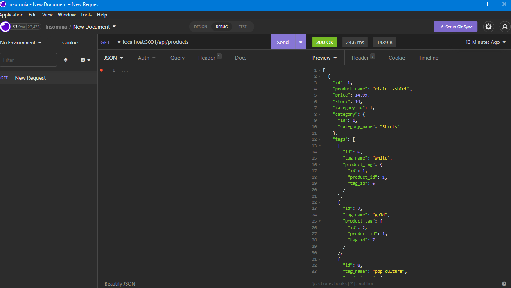

# E-commerce Back End 

## User Story

```
AS A manager at an internet retail company
I WANT a back end for my e-commerce website that uses the latest technologies
SO THAT my company can compete with other e-commerce companies
```

## Acceptance Criteria

```
GIVEN a functional Express.js API
WHEN I add my database name, MySQL username, and MySQL password to an environment variable file
THEN I am able to connect to a database using Sequelize
WHEN I enter schema and seed commands
THEN a development database is created and is seeded with test data
WHEN I enter the command to invoke the application
THEN my server is started and the Sequelize models are synced to the MySQL database
WHEN I open API GET routes in Insomnia Core for categories, products, or tags
THEN the data for each of these routes is displayed in a formatted JSON
WHEN I test API POST, PUT, and DELETE routes in Insomnia Core
THEN I am able to successfully create, update, and delete data in my database
```

## Intructions

```
1. Open terminal in db folder and log into mysql with "mysql -u root -p" and it will prompt user to enter password
2. Once logged in, run source schema.sql to create database
3. Leave db folder and return to root file
4. Run npm run seeds
5. Run npm install in command line to install dependencies
6. Run npm start in command line to start application
7. Open insomnia to interact with the database
```

## Photo of this project
-----


## Video walkthrough of this project
-----
